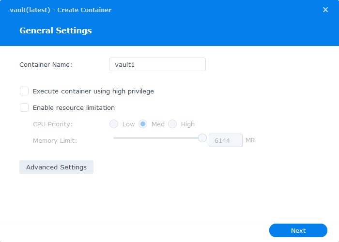
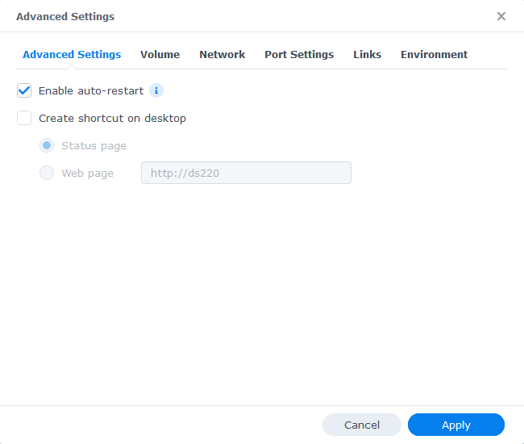
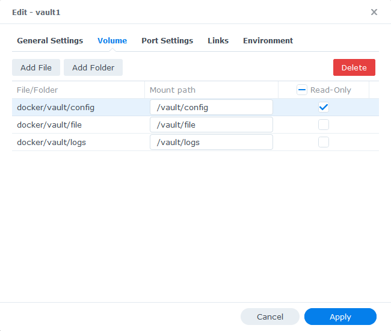
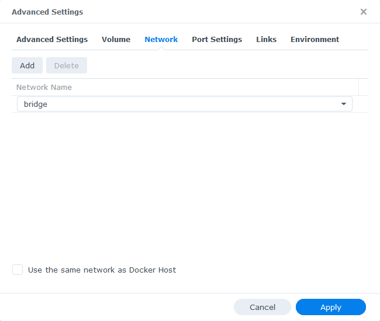
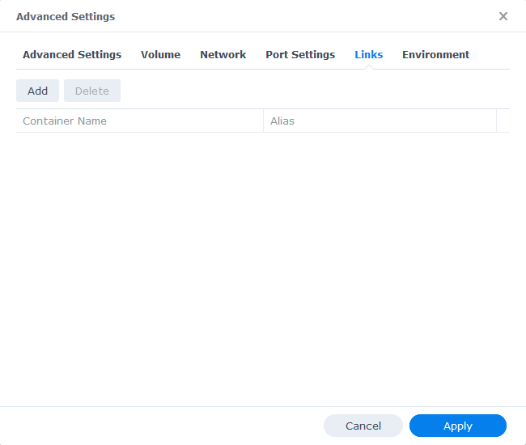
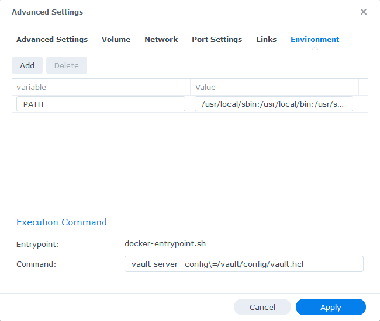
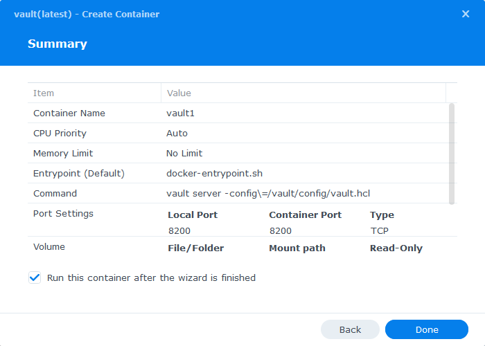

# Vault Server on Synology

1. click Vault image (launch `Create Container` window)

   

1. Enable auto-restart

   

1. Add folders

   - docker/vault/config : /vault/config
   - docker/vault/file : /vault/file
   - docker/vault/logs : /vault/logs

   

1. `Netwotk` tab (no change)

   

1. Port forwarding `8200:8200`

   

1. `Links` tab (no change)

   

1. Command:

   - `vault server -config\=/vault/config/vault.hcl`

   

1. Done!

   

---

- Vault configuration (`vault.hcl`)

  ```conf:/vault/config/vault.hcl
  disable_mlock = true
  ui            = true

  storage "file" {
    path = "/vault/data"
  }

  listener "tcp" {
    address         = "0.0.0.0:8200"
    tls_disable     = 1
  }
  ```
